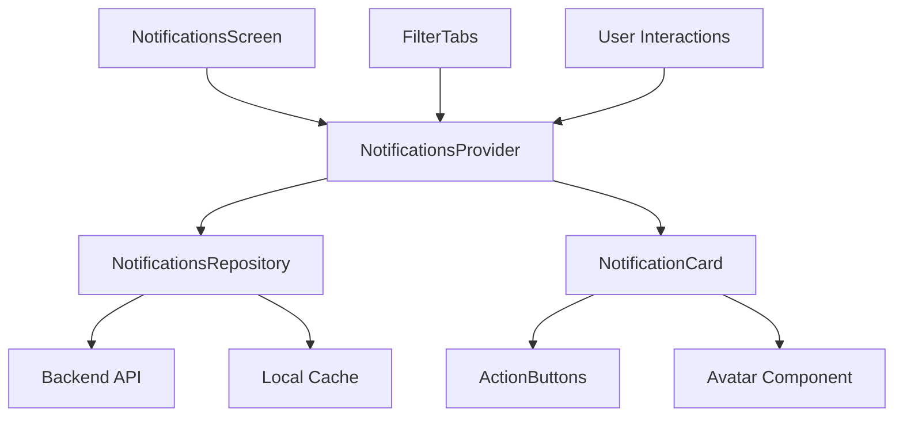

# Design Document: Notifications Page Redesign

## Overview

This document outlines the technical design for redesigning the notifications page in the Flutter job application. The redesign introduces a modern, categorized notification system with three distinct notification types (Jobs, Applications, Messages), visual state indicators, expandable cards, and contextual action buttons.

The design follows the existing Flutter app architecture patterns:
- Feature-based architecture (`features/notifications/`)
- Repository pattern for data access
- Clean Architecture with domain/data separation
- Riverpod for state management
- Consistent theming with `AppColors` and `AppTextStyles`

### Key Features

- **Three notification types** with colored border accents (Jobs/grey, Applications/black, Messages/violet)
- **Expandable notification cards** with smooth animations
- **Read/unread state management** with visual indicators
- **Filter tabs** for type-based filtering
- **Temporal grouping** (TODAY/YESTERDAY sections)
- **Contextual action buttons** within expanded cards
- **Real-time updates** and offline caching
- **Accessibility compliance** with screen reader support

## Architecture

### High-Level Architecture

The notifications feature follows Clean Architecture principles with clear separation of concerns:

```
features/notifications/
├── data/
│   ├── models/           # Data models (JSON serialization)
│   ├── providers/        # Riverpod providers
│   └── repositories/     # Data access layer
├── domain/
│   ├── entities/         # Business entities
│   └── repositories/     # Repository interfaces
├── screens/
│   └── notifications_screen.dart
└── widgets/
    ├── notification_card.dart
    ├── notification_filter_tabs.dart
    ├── notification_section_header.dart
    └── notification_action_buttons.dart
```

### Data Flow



### State Management Architecture

The notification system uses Riverpod with the following provider hierarchy:

- **NotificationsProvider**: Main state provider managing notification list and filters
- **NotificationStateProvider**: Individual notification state (read/expanded)
- **FilterProvider**: Active filter state management
- **SyncProvider**: Background sync and real-time updates

## Components and Interfaces

### Core Components

#### 1. NotificationsScreen
Main screen widget that orchestrates the entire notification interface.

**Responsibilities:**
- Render page header with title and "Mark all as read" action
- Display filter tabs
- Manage scrollable notification list
- Handle empty states
- Coordinate real-time updates

**Key Methods:**
```dart
class NotificationsScreen extends ConsumerWidget {
  Widget build(BuildContext context, WidgetRef ref);
  Widget _buildHeader();
  Widget _buildFilterTabs();
  Widget _buildNotificationsList();
  Widget _buildEmptyState();
}
```

#### 2. NotificationCard
Expandable card component for individual notifications.

**Responsibilities:**
- Display notification content (collapsed/expanded states)
- Handle tap interactions for expansion
- Show read/unread indicators
- Render type-specific border accents
- Manage action buttons in expanded state

**Key Properties:**
```dart
class NotificationCard extends StatefulWidget {
  final NotificationEntity notification;
  final bool isExpanded;
  final VoidCallback onTap;
  final Function(String) onMarkAsRead;
  final Function(String, String) onActionTap;
}
```

#### 3. NotificationFilterTabs
Horizontal tab bar for filtering notifications by type.

**Responsibilities:**
- Display filter options (All, Jobs, Messages, Applications)
- Handle tab selection
- Show active state styling
- Support horizontal scrolling on narrow screens

#### 4. NotificationActionButtons
Dynamic action buttons within expanded notification cards.

**Responsibilities:**
- Render type-specific action buttons
- Handle button interactions
- Apply appropriate styling (primary/secondary)
- Support responsive layout

### Interface Contracts

#### NotificationsRepository Interface
```dart
abstract class NotificationsRepository {
  Future<List<NotificationEntity>> getNotifications();
  Future<void> markAsRead(String notificationId);
  Future<void> markAllAsRead();
  Stream<List<NotificationEntity>> watchNotifications();
  Future<void> syncNotifications();
}
```

#### NotificationEntity
```dart
class NotificationEntity {
  final String id;
  final NotificationType type;
  final String title;
  final String message;
  final DateTime timestamp;
  final bool isRead;
  final String? avatarUrl;
  final Map<String, dynamic>? metadata;
  final List<NotificationAction> actions;
}
```

## Data Models

### Core Entities

#### NotificationEntity
```dart
class NotificationEntity {
  final String id;
  final NotificationType type;
  final String title;
  final String message;
  final DateTime timestamp;
  final bool isRead;
  final String? avatarUrl;
  final Map<String, dynamic>? metadata;
  final List<NotificationAction> actions;

  const NotificationEntity({
    required this.id,
    required this.type,
    required this.title,
    required this.message,
    required this.timestamp,
    required this.isRead,
    this.avatarUrl,
    this.metadata,
    required this.actions,
  });
}
```

#### NotificationType Enum
```dart
enum NotificationType {
  jobs('jobs', Color(0xFF545665)),
  applications('applications', Color(0xFF000000)),
  messages('messages', Color(0xFF401E66));

  const NotificationType(this.key, this.borderColor);
  final String key;
  final Color borderColor;
}
```

#### NotificationAction
```dart
class NotificationAction {
  final String id;
  final String label;
  final NotificationActionType type;
  final Map<String, dynamic>? parameters;

  const NotificationAction({
    required this.id,
    required this.label,
    required this.type,
    this.parameters,
  });
}

enum NotificationActionType {
  primary,   // Violet background, white text
  secondary, // Light background, dark text
}
```

### Data Models (JSON Serialization)

#### NotificationModel
```dart
class NotificationModel {
  final String id;
  final String type;
  final String title;
  final String message;
  final String timestamp;
  final bool isRead;
  final String? avatarUrl;
  final Map<String, dynamic>? metadata;
  final List<NotificationActionModel> actions;

  // JSON serialization methods
  factory NotificationModel.fromJson(Map<String, dynamic> json);
  Map<String, dynamic> toJson();
  
  // Entity conversion
  NotificationEntity toEntity();
  factory NotificationModel.fromEntity(NotificationEntity entity);
}
```

### State Models

#### NotificationsState
```dart
class NotificationsState {
  final List<NotificationEntity> notifications;
  final NotificationFilter activeFilter;
  final bool isLoading;
  final String? error;
  final Map<String, bool> expandedStates;
  final DateTime? lastSyncTime;

  const NotificationsState({
    required this.notifications,
    required this.activeFilter,
    required this.isLoading,
    this.error,
    required this.expandedStates,
    this.lastSyncTime,
  });

  NotificationsState copyWith({...});
}
```

#### NotificationFilter
```dart
enum NotificationFilter {
  all('Toutes'),
  jobs('jobs'),
  messages('messagerie'),
  applications('candidatures');

  const NotificationFilter(this.displayName);
  final String displayName;
}
```

## State Management

### Riverpod Providers

#### Main Notifications Provider
```dart
@riverpod
class NotificationsNotifier extends _$NotificationsNotifier {
  @override
  Future<NotificationsState> build() async {
    // Initialize with cached data, then sync
    final cached = await _loadCachedNotifications();
    final synced = await _syncNotifications();
    return NotificationsState(
      notifications: synced,
      activeFilter: NotificationFilter.all,
      isLoading: false,
      expandedStates: {},
    );
  }

  Future<void> markAsRead(String notificationId) async {
    // Optimistic update
    state = AsyncValue.data(state.value!.copyWith(
      notifications: state.value!.notifications.map((n) =>
        n.id == notificationId ? n.copyWith(isRead: true) : n
      ).toList(),
    ));

    // Sync to backend
    await ref.read(notificationsRepositoryProvider).markAsRead(notificationId);
  }

  void toggleExpanded(String notificationId) {
    final current = state.value!;
    final newExpandedStates = Map<String, bool>.from(current.expandedStates);
    newExpandedStates[notificationId] = !(newExpandedStates[notificationId] ?? false);
    
    state = AsyncValue.data(current.copyWith(
      expandedStates: newExpandedStates,
    ));
  }

  void setFilter(NotificationFilter filter) {
    state = AsyncValue.data(state.value!.copyWith(
      activeFilter: filter,
    ));
  }
}
```

#### Repository Provider
```dart
@riverpod
NotificationsRepository notificationsRepository(NotificationsRepositoryRef ref) {
  return NotificationsRepositoryImpl();
}
```

#### Filtered Notifications Provider
```dart
@riverpod
List<NotificationEntity> filteredNotifications(FilteredNotificationsRef ref) {
  final state = ref.watch(notificationsNotifierProvider);
  return state.when(
    data: (data) {
      final notifications = data.notifications;
      if (data.activeFilter == NotificationFilter.all) {
        return notifications;
      }
      return notifications.where((n) => 
        n.type.key == data.activeFilter.name
      ).toList();
    },
    loading: () => [],
    error: (_, __) => [],
  );
}
```

### State Persistence

The notification system implements multi-layer caching:

1. **Memory Cache**: Riverpod providers maintain in-memory state
2. **Local Storage**: SQLite/Hive for offline access
3. **Backend Sync**: Real-time updates via WebSocket/polling

## API Integration

### REST API Endpoints

#### Get Notifications
```dart
GET /api/notifications/
Query Parameters:
- limit: int (default: 50)
- offset: int (default: 0)
- type: string (optional filter)
- unread_only: bool (default: false)

Response:
{
  "notifications": [NotificationModel],
  "total_count": int,
  "unread_count": int
}
```

#### Mark as Read
```dart
PATCH /api/notifications/{id}/mark-read/
Response: 204 No Content
```

#### Mark All as Read
```dart
POST /api/notifications/mark-all-read/
Body: { "type": "string" } // optional filter
Response: 204 No Content
```

### Repository Implementation

```dart
class NotificationsRepositoryImpl implements NotificationsRepository {
  final ApiClient _apiClient;
  final LocalStorage _localStorage;

  @override
  Future<List<NotificationEntity>> getNotifications() async {
    try {
      // Try network first
      final response = await _apiClient.get('/api/notifications/');
      final notifications = (response.data['notifications'] as List)
          .map((json) => NotificationModel.fromJson(json).toEntity())
          .toList();
      
      // Cache locally
      await _localStorage.saveNotifications(notifications);
      return notifications;
    } catch (e) {
      // Fallback to cache
      return await _localStorage.getNotifications();
    }
  }

  @override
  Future<void> markAsRead(String notificationId) async {
    // Update local cache immediately
    await _localStorage.markAsRead(notificationId);
    
    // Sync to backend
    try {
      await _apiClient.patch('/api/notifications/$notificationId/mark-read/');
    } catch (e) {
      // Queue for retry
      await _localStorage.queueSyncAction('mark_read', notificationId);
    }
  }

  @override
  Stream<List<NotificationEntity>> watchNotifications() {
    // Combine local updates with real-time sync
    return Stream.merge([
      _localStorage.watchNotifications(),
      _realTimeUpdates(),
    ]);
  }
}
```

## Flutter Widget Structure

### Screen Hierarchy

```dart
NotificationsScreen
├── AppBar (with "Mark all as read")
├── NotificationFilterTabs
└── NotificationsList
    ├── SectionHeader ("TODAY")
    ├── NotificationCard (expandable)
    │   ├── NotificationHeader
    │   │   ├── Avatar
    │   │   ├── Content (title, timestamp)
    │   │   └── UnreadIndicator
    │   └── ExpandedContent (when expanded)
    │       ├── MessageContent
    │       └── ActionButtons
    ├── SectionHeader ("YESTERDAY")
    └── [More NotificationCards...]
```

### Key Widget Implementations

#### NotificationCard Widget
```dart
class NotificationCard extends ConsumerWidget {
  final NotificationEntity notification;

  @override
  Widget build(BuildContext context, WidgetRef ref) {
    final isExpanded = ref.watch(
      notificationsNotifierProvider.select((state) =>
        state.value?.expandedStates[notification.id] ?? false
      )
    );

    return AnimatedContainer(
      duration: const Duration(milliseconds: 300),
      curve: Curves.easeInOut,
      decoration: BoxDecoration(
        color: AppColors.surface,
        borderRadius: BorderRadius.circular(12),
        border: Border.all(color: const Color(0xFFF8FAFC)),
        boxShadow: [
          BoxShadow(
            color: Colors.black.withOpacity(0.05),
            blurRadius: 2,
            offset: const Offset(0, 1),
          ),
        ],
      ),
      child: Material(
        color: Colors.transparent,
        child: InkWell(
          onTap: () => _handleTap(ref),
          borderRadius: BorderRadius.circular(12),
          child: Container(
            decoration: BoxDecoration(
              borderRadius: BorderRadius.circular(12),
              border: Border(
                left: BorderSide(
                  color: notification.type.borderColor,
                  width: 3,
                ),
              ),
            ),
            child: Padding(
              padding: const EdgeInsets.all(12),
              child: Column(
                children: [
                  _buildHeader(),
                  if (isExpanded) ...[
                    const SizedBox(height: 12),
                    _buildExpandedContent(),
                  ],
                ],
              ),
            ),
          ),
        ),
      ),
    );
  }

  void _handleTap(WidgetRef ref) {
    // Mark as read if unread
    if (!notification.isRead) {
      ref.read(notificationsNotifierProvider.notifier)
          .markAsRead(notification.id);
    }
    
    // Toggle expansion
    ref.read(notificationsNotifierProvider.notifier)
        .toggleExpanded(notification.id);
  }
}
```

#### Filter Tabs Widget
```dart
class NotificationFilterTabs extends ConsumerWidget {
  @override
  Widget build(BuildContext context, WidgetRef ref) {
    final activeFilter = ref.watch(
      notificationsNotifierProvider.select((state) =>
        state.value?.activeFilter ?? NotificationFilter.all
      )
    );

    return Container(
      height: 48,
      child: ListView.builder(
        scrollDirection: Axis.horizontal,
        padding: const EdgeInsets.symmetric(horizontal: 16),
        itemCount: NotificationFilter.values.length,
        itemBuilder: (context, index) {
          final filter = NotificationFilter.values[index];
          final isActive = filter == activeFilter;
          
          return Padding(
            padding: const EdgeInsets.only(right: 24),
            child: GestureDetector(
              onTap: () => ref.read(notificationsNotifierProvider.notifier)
                  .setFilter(filter),
              child: Container(
                padding: const EdgeInsets.symmetric(vertical: 12),
                decoration: BoxDecoration(
                  border: isActive ? Border(
                    bottom: BorderSide(
                      color: AppColors.violet,
                      width: 2,
                    ),
                  ) : null,
                ),
                child: Text(
                  filter.displayName,
                  style: isActive 
                    ? AppTextStyles.tabActive 
                    : AppTextStyles.tabInactive,
                ),
              ),
            ),
          );
        },
      ),
    );
  }
}
```

### Animation and Transitions

The notification system uses smooth animations for:

1. **Card Expansion**: `AnimatedContainer` with 300ms duration
2. **Filter Tab Transitions**: Smooth underline animation
3. **Read State Changes**: Fade out unread indicator
4. **List Updates**: `AnimatedList` for insertions/removals

```dart
// Card expansion animation
AnimatedContainer(
  duration: const Duration(milliseconds: 300),
  curve: Curves.easeInOut,
  height: isExpanded ? null : 80,
  child: content,
)

// Unread indicator fade
AnimatedOpacity(
  opacity: notification.isRead ? 0.0 : 1.0,
  duration: const Duration(milliseconds: 200),
  child: UnreadIndicator(),
)
```

## Correctness Properties

*A property is a characteristic or behavior that should hold true across all valid executions of a system-essentially, a formal statement about what the system should do. Properties serve as the bridge between human-readable specifications and machine-verifiable correctness guarantees.*

### Property 1: Notification Type Border Mapping

*For any* notification with a valid notification type, the rendered border color SHALL match the expected color for that type (Jobs: #545665, Applications: #000000, Messages: #401E66)

**Validates: Requirements 1.1, 1.2**

### Property 2: Read State Indicator Display

*For any* notification, the unread indicator SHALL be visible if and only if the notification's read state is false

**Validates: Requirements 2.1, 2.2**

### Property 3: Tap-to-Read State Transition

*For any* notification with read state false, tapping the notification SHALL update the read state to true

**Validates: Requirements 2.3**

### Property 4: Expansion State Content Display

*For any* notification, the displayed content elements SHALL match the expansion state (collapsed: title, timestamp, avatar only; expanded: all elements including message and actions)

**Validates: Requirements 3.1, 3.2**

### Property 5: Filter Type Matching

*For any* selected filter and notification list, the displayed notifications SHALL contain only notifications matching the filter type (or all notifications if "Toutes" is selected)

**Validates: Requirements 5.2**

### Property 6: Avatar Component Sizing

*For any* notification card, the avatar component SHALL have dimensions of exactly 48x48 pixels

**Validates: Requirements 8.1**

### Property 7: Type-Specific Avatar Rendering

*For any* notification of type Messages, the avatar component SHALL be circular with a message badge icon overlay

**Validates: Requirements 8.2**

### Property 8: Timestamp Format Consistency

*For any* notification timestamp, the displayed format SHALL correctly represent the time difference ("Xmin" for <1 hour, "Xh" for <24 hours, "Xj" for ≥24 hours)

**Validates: Requirements 13.1**

## Error Handling

### Network Error Handling

The notification system implements robust error handling for network-related issues:

#### Connection Failures
```dart
class NotificationsRepositoryImpl {
  Future<List<NotificationEntity>> getNotifications() async {
    try {
      return await _fetchFromNetwork();
    } on NetworkException catch (e) {
      // Fallback to cached data
      final cached = await _localStorage.getNotifications();
      if (cached.isEmpty) {
        throw NotificationException('No cached data available', e);
      }
      return cached;
    }
  }
}
```

#### API Error Responses
- **4xx Client Errors**: Show user-friendly error messages
- **5xx Server Errors**: Retry with exponential backoff
- **Timeout Errors**: Fallback to cached data with retry option

#### Sync Failure Recovery
```dart
class SyncManager {
  Future<void> handleSyncFailure(SyncAction action) async {
    // Queue failed actions for retry
    await _queueManager.addAction(action);
    
    // Schedule retry with exponential backoff
    final delay = _calculateBackoffDelay(action.retryCount);
    Timer(delay, () => _retrySync(action));
  }
}
```

### State Management Error Handling

#### Provider Error States
```dart
@riverpod
class NotificationsNotifier extends _$NotificationsNotifier {
  @override
  Future<NotificationsState> build() async {
    try {
      final notifications = await _loadNotifications();
      return NotificationsState.success(notifications);
    } catch (e, stackTrace) {
      // Log error for debugging
      _logger.error('Failed to load notifications', e, stackTrace);
      
      // Return error state with cached data if available
      final cached = await _loadCachedNotifications();
      return NotificationsState.error(e.toString(), cached);
    }
  }
}
```

#### UI Error Display
- **Loading States**: Skeleton screens during data fetch
- **Error States**: Retry buttons with clear error messages
- **Empty States**: Contextual messages based on filter selection
- **Offline States**: Clear indication when using cached data

### Data Validation

#### Input Validation
```dart
class NotificationValidator {
  static ValidationResult validate(NotificationModel notification) {
    final errors = <String>[];
    
    if (notification.id.isEmpty) {
      errors.add('Notification ID cannot be empty');
    }
    
    if (notification.title.isEmpty) {
      errors.add('Notification title is required');
    }
    
    if (!NotificationType.values.any((t) => t.key == notification.type)) {
      errors.add('Invalid notification type: ${notification.type}');
    }
    
    return ValidationResult(isValid: errors.isEmpty, errors: errors);
  }
}
```

#### Data Consistency Checks
- Validate notification timestamps are not in the future
- Ensure required fields are present before rendering
- Check avatar URLs are valid before loading images
- Validate action button configurations

## Testing Strategy

### Dual Testing Approach

The notification system uses both unit tests and property-based tests for comprehensive coverage:

#### Unit Tests
Focus on specific examples, edge cases, and integration points:

- **Widget Tests**: Verify UI components render correctly with specific data
- **Integration Tests**: Test API integration with mocked responses
- **Edge Case Tests**: Handle empty states, network failures, malformed data
- **Accessibility Tests**: Verify screen reader compatibility and keyboard navigation

Example unit tests:
```dart
testWidgets('displays empty state when no notifications', (tester) async {
  await tester.pumpWidget(NotificationsScreen());
  expect(find.text('Aucune notification'), findsOneWidget);
});

testWidgets('shows correct filter tabs', (tester) async {
  await tester.pumpWidget(NotificationFilterTabs());
  expect(find.text('Toutes'), findsOneWidget);
  expect(find.text('jobs'), findsOneWidget);
  expect(find.text('messagerie'), findsOneWidget);
  expect(find.text('candidatures'), findsOneWidget);
});
```

#### Property-Based Tests

Verify universal properties across randomized inputs using the `test` package with custom generators:

**Property Test Configuration:**
- Minimum 100 iterations per property test
- Custom generators for notification data
- Each test references its design document property
- Tag format: **Feature: notifications-page-redesign, Property {number}: {property_text}**

Example property tests:
```dart
group('Notification Properties', () {
  testProperty('notification type border mapping', 
    forAll(notificationGenerator, (notification) {
      final widget = NotificationCard(notification: notification);
      final borderColor = extractBorderColor(widget);
      return borderColor == notification.type.borderColor;
    }),
    tags: ['Feature: notifications-page-redesign, Property 1: Notification Type Border Mapping'],
  );

  testProperty('read state indicator display',
    forAll(notificationGenerator, (notification) {
      final widget = NotificationCard(notification: notification);
      final hasIndicator = hasUnreadIndicator(widget);
      return hasIndicator == !notification.isRead;
    }),
    tags: ['Feature: notifications-page-redesign, Property 2: Read State Indicator Display'],
  );
});
```

#### Test Data Generators

Custom generators for property-based testing:
```dart
final notificationGenerator = Generator.combine3(
  Generator.string(minLength: 1, maxLength: 100), // title
  Generator.element(NotificationType.values),      // type
  Generator.boolean(),                             // isRead
  (title, type, isRead) => NotificationEntity(
    id: Generator.uuid().generate(),
    title: title,
    type: type,
    isRead: isRead,
    timestamp: DateTime.now(),
    message: Generator.string().generate(),
    actions: [],
  ),
);
```

### Performance Testing

#### Scroll Performance
- Test smooth scrolling with 100+ notifications
- Verify 60fps performance during expansion animations
- Measure memory usage with large notification lists

#### Load Testing
- Test initial load time with varying notification counts
- Verify lazy loading implementation
- Test background sync performance impact

### Accessibility Testing

#### Screen Reader Compatibility
- Verify semantic labels for all interactive elements
- Test navigation with TalkBack/VoiceOver
- Ensure proper focus management

#### Keyboard Navigation
- Test tab order through notification cards
- Verify keyboard shortcuts for common actions
- Test high contrast mode compatibility

### Integration Testing

#### API Integration
- Mock backend responses for different scenarios
- Test offline/online state transitions
- Verify real-time update handling

#### State Persistence
- Test notification state across app restarts
- Verify sync after network reconnection
- Test data migration scenarios

## Performance Considerations

### Lazy Loading Implementation

The notification list implements efficient lazy loading to handle large datasets:

```dart
class NotificationsList extends ConsumerWidget {
  @override
  Widget build(BuildContext context, WidgetRef ref) {
    return ListView.builder(
      itemBuilder: (context, index) {
        // Load more when approaching end
        if (index >= notifications.length - 5) {
          ref.read(notificationsNotifierProvider.notifier).loadMore();
        }
        
        return NotificationCard(notification: notifications[index]);
      },
      itemCount: notifications.length,
    );
  }
}
```

### Memory Management

#### Widget Recycling
- Use `ListView.builder` for efficient widget recycling
- Implement proper disposal of animation controllers
- Cache rendered notification cards for smooth re-expansion

#### Image Caching
```dart
class AvatarComponent extends StatelessWidget {
  Widget build(BuildContext context) {
    return CachedNetworkImage(
      imageUrl: avatarUrl,
      memCacheWidth: 48,
      memCacheHeight: 48,
      placeholder: (context, url) => CircularProgressIndicator(),
      errorWidget: (context, url, error) => DefaultAvatar(),
    );
  }
}
```

### Animation Optimization

#### Efficient Animations
- Use `AnimatedContainer` for smooth expansion transitions
- Implement `SingleTickerProviderStateMixin` for controlled animations
- Dispose animation controllers properly to prevent memory leaks

```dart
class NotificationCard extends StatefulWidget {
  @override
  _NotificationCardState createState() => _NotificationCardState();
}

class _NotificationCardState extends State<NotificationCard>
    with SingleTickerProviderStateMixin {
  late AnimationController _controller;
  late Animation<double> _expandAnimation;

  @override
  void initState() {
    super.initState();
    _controller = AnimationController(
      duration: const Duration(milliseconds: 300),
      vsync: this,
    );
    _expandAnimation = CurvedAnimation(
      parent: _controller,
      curve: Curves.easeInOut,
    );
  }

  @override
  void dispose() {
    _controller.dispose();
    super.dispose();
  }
}
```

### Background Sync Optimization

#### Efficient Sync Strategy
- Use WebSocket connections for real-time updates when app is active
- Implement background sync with WorkManager for offline scenarios
- Batch API calls to reduce network overhead

```dart
class BackgroundSyncManager {
  Timer? _syncTimer;

  void startPeriodicSync() {
    _syncTimer = Timer.periodic(
      const Duration(minutes: 5),
      (_) => _performBackgroundSync(),
    );
  }

  Future<void> _performBackgroundSync() async {
    if (await _hasNetworkConnection()) {
      await ref.read(notificationsRepositoryProvider).syncNotifications();
    }
  }
}
```

## Security Considerations

### Data Protection

#### Sensitive Information Handling
- Sanitize notification content before display
- Implement proper data encryption for local storage
- Use secure HTTP headers for API communication

#### Authentication Integration
```dart
class AuthenticatedApiClient {
  Future<Response> get(String endpoint) async {
    final token = await _authService.getValidToken();
    return _httpClient.get(
      endpoint,
      headers: {
        'Authorization': 'Bearer $token',
        'Content-Type': 'application/json',
      },
    );
  }
}
```

### Input Validation

#### XSS Prevention
- Sanitize all user-generated content in notifications
- Use Flutter's built-in text rendering (no HTML parsing)
- Validate image URLs before loading

#### API Security
- Implement request rate limiting
- Validate all API responses before processing
- Use HTTPS for all network communication

### Privacy Compliance

#### Data Minimization
- Only cache essential notification data locally
- Implement data retention policies
- Provide user controls for data deletion

#### User Consent
- Clear privacy notices for notification data usage
- Opt-in mechanisms for real-time sync features
- User controls for notification preferences

## Deployment and Monitoring

### Feature Flags

Implement feature flags for gradual rollout:

```dart
class FeatureFlags {
  static bool get isNewNotificationsEnabled =>
      _remoteConfig.getBool('new_notifications_enabled');
      
  static bool get isRealTimeSyncEnabled =>
      _remoteConfig.getBool('real_time_sync_enabled');
}
```

### Analytics and Monitoring

#### Performance Metrics
- Track notification load times
- Monitor scroll performance metrics
- Measure user engagement with different notification types

#### Error Tracking
```dart
class NotificationAnalytics {
  static void trackNotificationInteraction(String notificationId, String action) {
    _analytics.track('notification_interaction', {
      'notification_id': notificationId,
      'action': action,
      'timestamp': DateTime.now().toIso8601String(),
    });
  }

  static void trackError(String error, Map<String, dynamic> context) {
    _crashlytics.recordError(error, null, context: context);
  }
}
```

### A/B Testing Support

#### Variant Testing
- Test different notification card layouts
- Compare expansion animation durations
- Evaluate filter tab positioning options

```dart
class NotificationVariants {
  static NotificationCardVariant get cardVariant {
    final variant = _abTesting.getVariant('notification_card_design');
    return NotificationCardVariant.values.firstWhere(
      (v) => v.name == variant,
      orElse: () => NotificationCardVariant.standard,
    );
  }
}
```

This comprehensive design provides a solid foundation for implementing the notifications page redesign while maintaining consistency with the existing Flutter app architecture and ensuring scalability, performance, and maintainability.