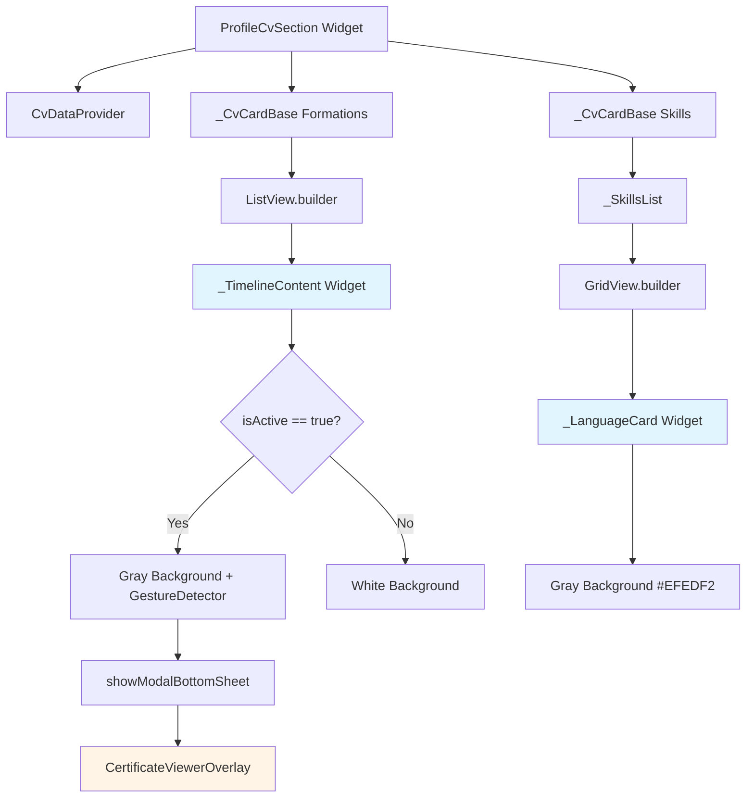
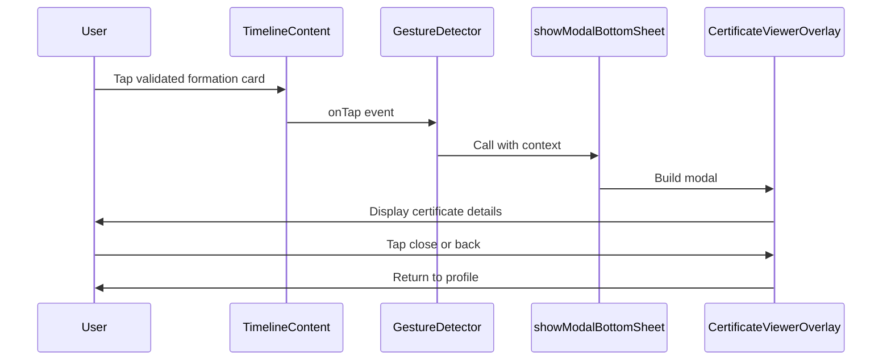

# Design Document: Profile CV Section Enhancements

## Overview

This design document outlines the implementation of UI enhancements to the Profile CV Section in the Flutter mobile application. The feature adds visual distinction for validated formations through background color changes, enables interactive certificate viewing via tappable formation cards, and standardizes language card styling for visual consistency.

### Goals

1. **Visual Distinction**: Make validated diplomas immediately recognizable through gray background color (#EFEDF2)
2. **Interactive Certificates**: Enable users to view certificate details by tapping validated formation cards
3. **Design Consistency**: Standardize language card background colors to match the established design system
4. **Architecture Preservation**: Maintain the existing Flutter/Riverpod architecture pattern without modifying domain or data layers

### Non-Goals

- Modifying domain entities (CvFormationEntity already has `isActive` field)
- Changing data providers or state management logic
- Adding new certificate upload functionality (already exists)
- Modifying the animation behavior of the card stack
- Changes to experiences, skills, or other CV sections beyond formations and languages

## Architecture

### High-Level Component Interaction



### Layer Responsibilities

#### Presentation Layer (Widgets)
- **ProfileCvSection**: Main stateful widget managing card stack animations
- **_TimelineContent**: Renders formation/experience cards with conditional styling and tap handling
- **_LanguageCard**: Renders language proficiency cards with updated background color
- **CertificateViewerOverlay**: Modal overlay for displaying certificate details (already exists in `profile_add_overlays.dart`)

#### Data Layer (Providers)
- **cvDataProvider**: Provides CvEntity data (no changes required)
- **profileProvider**: Manages profile state (no changes required)

#### Domain Layer (Entities)
- **CvFormationEntity**: Contains `isActive` field for validation status (no changes required)
- **CvEntity**: Aggregates all CV data (no changes required)

## Components and Interfaces

### 1. _TimelineContent Widget Modifications

**Current Signature:**
```dart
class _TimelineContent extends StatelessWidget {
  final String title, company, location, date;
  final String? secondaryDate;
  final bool isAppMission;
  final String? badgeText;
  final IconData? icon;
  
  const _TimelineContent({...});
}
```

**Enhanced Signature:**
```dart
class _TimelineContent extends StatelessWidget {
  final String title, company, location, date;
  final String? secondaryDate;
  final bool isAppMission;
  final String? badgeText;
  final IconData? icon;
  final bool isValidated;  // NEW: Derived from badgeText == 'VALIDE'
  final VoidCallback? onTap;  // NEW: Callback for tap handling
  
  const _TimelineContent({...});
}
```

**Key Changes:**
1. Add `isValidated` parameter (derived from `badgeText == 'VALIDE'`)
2. Add optional `onTap` callback parameter
3. Conditionally set background color based on `isValidated`
4. Wrap container in `GestureDetector` when `onTap` is provided
5. Import `_kJobCardGray` constant from `profile_add_overlays.dart`

### 2. _LanguageCard Widget Modifications

**Current Implementation:**
```dart
class _LanguageCard extends StatelessWidget {
  final CvLanguageEntity language;
  const _LanguageCard(this.language);

  @override
  Widget build(BuildContext context) {
    return Container(
      padding: const EdgeInsets.symmetric(horizontal: 16, vertical: 12),
      decoration: BoxDecoration(
        color: const Color(0xFFF8F9FB),  // OLD COLOR
        borderRadius: BorderRadius.circular(12),
      ),
      child: Column(...),
    );
  }
}
```

**Enhanced Implementation:**
```dart
class _LanguageCard extends StatelessWidget {
  final CvLanguageEntity language;
  const _LanguageCard(this.language);

  @override
  Widget build(BuildContext context) {
    return Container(
      padding: const EdgeInsets.symmetric(horizontal: 16, vertical: 12),
      decoration: BoxDecoration(
        color: const Color(0xFFEFEDF2),  // NEW COLOR (_kJobCardGray)
        borderRadius: BorderRadius.circular(12),
      ),
      child: Column(...),
    );
  }
}
```

**Key Changes:**
1. Change background color from `Color(0xFFF8F9FB)` to `Color(0xFFEFEDF2)`
2. Maintain all other styling properties unchanged

### 3. Formation Card Rendering in ListView.builder

**Current Implementation:**
```dart
ListView.builder(
  physics: const NeverScrollableScrollPhysics(),
  padding: const EdgeInsets.fromLTRB(16, 16, 16, 120),
  itemCount: cv.formations.length,
  itemBuilder: (context, i) {
    final f = cv.formations[i];
    return _TimelineContent(
      title: f.title,
      company: f.institution,
      location: f.location,
      date: f.year.toString(),
      badgeText: f.isActive ? 'VALIDE' : null,
      icon: Icons.school_outlined,
    );
  },
)
```

**Enhanced Implementation:**
```dart
ListView.builder(
  physics: const NeverScrollableScrollPhysics(),
  padding: const EdgeInsets.fromLTRB(16, 16, 16, 120),
  itemCount: cv.formations.length,
  itemBuilder: (context, i) {
    final f = cv.formations[i];
    final isValidated = f.isActive;
    return _TimelineContent(
      title: f.title,
      company: f.institution,
      location: f.location,
      date: f.year.toString(),
      badgeText: isValidated ? 'VALIDE' : null,
      icon: Icons.school_outlined,
      isValidated: isValidated,  // NEW
      onTap: isValidated ? () {  // NEW
        showModalBottomSheet(
          context: context,
          isScrollControlled: true,
          backgroundColor: Colors.transparent,
          builder: (context) => CertificateViewerOverlay(
            title: f.title,
            institution: f.institution,
            fileName: 'diplome_${f.title.toLowerCase().replaceAll(' ', '_')}.pdf',
          ),
        );
      } : null,
    );
  },
)
```

**Key Changes:**
1. Extract `isValidated` boolean from `f.isActive`
2. Pass `isValidated` to `_TimelineContent`
3. Pass `onTap` callback only when `isValidated` is true
4. Use `showModalBottomSheet` with proper parameters
5. Pass formation data to `CertificateViewerOverlay`

## Data Models

No changes to existing data models are required. The feature uses existing fields:

### CvFormationEntity (Existing)
```dart
class CvFormationEntity {
  final String title;
  final String institution;
  final String location;
  final int year;
  final bool isActive;  // Used to determine validation status
  
  const CvFormationEntity({...});
}
```

### CvLanguageEntity (Existing)
```dart
class CvLanguageEntity {
  final String name;
  final String level;
  
  const CvLanguageEntity({...});
}
```

## Correctness Properties

This feature involves UI rendering and styling changes that are not suitable for property-based testing. The changes are:

1. **UI Styling**: Background color changes based on state (validated vs non-validated)
2. **UI Interaction**: Tap gesture handling and modal presentation
3. **Visual Consistency**: Standardizing colors across components

These are best validated through:
- **Snapshot tests**: Verify visual rendering of validated vs non-validated cards
- **Widget tests**: Verify tap behavior and modal presentation
- **Integration tests**: Verify end-to-end user flow from tap to certificate viewer

Property-based testing is not applicable because:
- The behavior is deterministic based on a boolean flag (`isActive`)
- The output is visual rendering, not data transformation
- There are no universal properties that hold across random inputs
- The feature is primarily about UI presentation, not business logic

## Error Handling

### Tap Handling Edge Cases

1. **Null Formation Data**
   - **Scenario**: Formation data is incomplete or null
   - **Handling**: Only enable tap when `isValidated` is true and formation has required fields
   - **Implementation**: Check `f.isActive` before creating tap callback

2. **Modal Presentation Failure**
   - **Scenario**: `showModalBottomSheet` fails to present
   - **Handling**: Flutter's built-in error handling for modal presentation
   - **Implementation**: No additional error handling required (Flutter handles this)

3. **Missing Certificate File**
   - **Scenario**: Certificate file reference is null or invalid
   - **Handling**: `CertificateViewerOverlay` accepts optional `fileName` parameter
   - **Implementation**: Pass `fileName` as optional, overlay displays placeholder if null

### Color Constant Import

1. **Missing _kJobCardGray Constant**
   - **Scenario**: `_kJobCardGray` is not accessible from `profile_add_overlays.dart`
   - **Handling**: Define constant locally in `profile_cv_section.dart` if import fails
   - **Implementation**: 
     ```dart
     // Option 1: Import from profile_add_overlays.dart
     import 'package:job_app/features/profile/widgets/profile_add_overlays.dart' show _kJobCardGray;
     
     // Option 2: Define locally if import not possible (private constant)
     const Color _kJobCardGray = Color(0xFFEFEDF2);
     ```

### Animation State Conflicts

1. **Tap During Card Animation**
   - **Scenario**: User taps formation card while card stack is animating
   - **Handling**: Tap is processed normally; modal opens on top of animation
   - **Implementation**: No special handling required (Flutter handles gesture priority)

## Testing Strategy

### Unit Tests

#### 1. _TimelineContent Widget Tests
```dart
testWidgets('_TimelineContent shows gray background when isValidated is true', (tester) async {
  await tester.pumpWidget(
    MaterialApp(
      home: Scaffold(
        body: _TimelineContent(
          title: 'Master Design',
          company: 'École de Design',
          location: 'Nantes',
          date: '2023',
          badgeText: 'VALIDE',
          icon: Icons.school_outlined,
          isValidated: true,
        ),
      ),
    ),
  );
  
  final container = tester.widget<Container>(find.byType(Container).first);
  final decoration = container.decoration as BoxDecoration;
  expect(decoration.color, equals(const Color(0xFFEFEDF2)));
});

testWidgets('_TimelineContent shows white background when isValidated is false', (tester) async {
  await tester.pumpWidget(
    MaterialApp(
      home: Scaffold(
        body: _TimelineContent(
          title: 'Master Design',
          company: 'École de Design',
          location: 'Nantes',
          date: '2023',
          icon: Icons.school_outlined,
          isValidated: false,
        ),
      ),
    ),
  );
  
  final container = tester.widget<Container>(find.byType(Container).first);
  final decoration = container.decoration as BoxDecoration;
  expect(decoration.color, equals(Colors.white));
});

testWidgets('_TimelineContent is tappable when onTap is provided', (tester) async {
  bool tapped = false;
  
  await tester.pumpWidget(
    MaterialApp(
      home: Scaffold(
        body: _TimelineContent(
          title: 'Master Design',
          company: 'École de Design',
          location: 'Nantes',
          date: '2023',
          badgeText: 'VALIDE',
          icon: Icons.school_outlined,
          isValidated: true,
          onTap: () => tapped = true,
        ),
      ),
    ),
  );
  
  await tester.tap(find.byType(_TimelineContent));
  expect(tapped, isTrue);
});

testWidgets('_TimelineContent is not tappable when onTap is null', (tester) async {
  await tester.pumpWidget(
    MaterialApp(
      home: Scaffold(
        body: _TimelineContent(
          title: 'Master Design',
          company: 'École de Design',
          location: 'Nantes',
          date: '2023',
          icon: Icons.school_outlined,
          isValidated: false,
          onTap: null,
        ),
      ),
    ),
  );
  
  expect(find.byType(GestureDetector), findsNothing);
});
```

#### 2. _LanguageCard Widget Tests
```dart
testWidgets('_LanguageCard shows correct background color', (tester) async {
  await tester.pumpWidget(
    MaterialApp(
      home: Scaffold(
        body: _LanguageCard(
          CvLanguageEntity(name: 'Français', level: 'Courant (C2)'),
        ),
      ),
    ),
  );
  
  final container = tester.widget<Container>(find.byType(Container).first);
  final decoration = container.decoration as BoxDecoration;
  expect(decoration.color, equals(const Color(0xFFEFEDF2)));
});

testWidgets('_LanguageCard maintains existing layout', (tester) async {
  await tester.pumpWidget(
    MaterialApp(
      home: Scaffold(
        body: _LanguageCard(
          CvLanguageEntity(name: 'Français', level: 'Courant (C2)'),
        ),
      ),
    ),
  );
  
  expect(find.text('Français'), findsOneWidget);
  expect(find.text('Courant (C2)'), findsOneWidget);
  
  final container = tester.widget<Container>(find.byType(Container).first);
  final decoration = container.decoration as BoxDecoration;
  expect(decoration.borderRadius, equals(BorderRadius.circular(12)));
});
```

#### 3. Formation ListView Integration Tests
```dart
testWidgets('Formation ListView opens certificate viewer on validated formation tap', (tester) async {
  final cv = CvEntity(
    formations: [
      CvFormationEntity(
        title: 'Master Design',
        institution: 'École de Design',
        location: 'Nantes',
        year: 2023,
        isActive: true,
      ),
    ],
    experiences: [],
    languages: [],
    skills: [],
  );
  
  await tester.pumpWidget(
    MaterialApp(
      home: Scaffold(
        body: ProfileCvSection(
          cvProvider: Provider((ref) => AsyncValue.data(cv)),
        ),
      ),
    ),
  );
  
  await tester.tap(find.text('Master Design'));
  await tester.pumpAndSettle();
  
  expect(find.byType(CertificateViewerOverlay), findsOneWidget);
  expect(find.text('Certificat de formation'), findsOneWidget);
});

testWidgets('Formation ListView does not open modal on non-validated formation tap', (tester) async {
  final cv = CvEntity(
    formations: [
      CvFormationEntity(
        title: 'Bachelor Design',
        institution: 'École de Design',
        location: 'Nantes',
        year: 2021,
        isActive: false,
      ),
    ],
    experiences: [],
    languages: [],
    skills: [],
  );
  
  await tester.pumpWidget(
    MaterialApp(
      home: Scaffold(
        body: ProfileCvSection(
          cvProvider: Provider((ref) => AsyncValue.data(cv)),
        ),
      ),
    ),
  );
  
  await tester.tap(find.text('Bachelor Design'));
  await tester.pumpAndSettle();
  
  expect(find.byType(CertificateViewerOverlay), findsNothing);
});
```

### Integration Tests

#### 1. End-to-End Certificate Viewing Flow
```dart
testWidgets('User can view certificate from validated formation', (tester) async {
  // Setup: Load profile with validated formation
  // Action: Navigate to profile, tap validated formation card
  // Verify: Certificate viewer modal opens with correct data
  // Action: Tap download button
  // Verify: Download snackbar appears
  // Action: Close modal
  // Verify: Returns to profile view
});
```

#### 2. Visual Consistency Verification
```dart
testWidgets('Validated formations and language cards have matching background colors', (tester) async {
  // Setup: Load profile with validated formations and languages
  // Verify: All validated formation cards have #EFEDF2 background
  // Verify: All language cards have #EFEDF2 background
  // Verify: Non-validated formations have white background
});
```

### Snapshot Tests

#### 1. Formation Card Variants
- Validated formation card with gray background
- Non-validated formation card with white background
- Formation card with "VALIDE" badge
- Formation card without badge

#### 2. Language Card Variants
- Language card with new gray background
- Language card in grid layout (2 columns)

### Manual Testing Checklist

- [ ] Validated formation cards display with gray background (#EFEDF2)
- [ ] Non-validated formation cards display with white background
- [ ] Tapping validated formation opens certificate viewer modal
- [ ] Tapping non-validated formation does nothing
- [ ] Certificate viewer displays correct formation title and institution
- [ ] Certificate viewer modal can be dismissed
- [ ] Language cards display with gray background (#EFEDF2)
- [ ] Language card layout remains unchanged (2 columns, 12px spacing)
- [ ] All text styles remain unchanged
- [ ] Card stack animations work correctly
- [ ] No visual regressions in other CV sections
- [ ] Ripple effect appears on validated formation tap (Android)
- [ ] Opacity change appears on validated formation tap (iOS)

## Implementation Plan

### Phase 1: Import and Constants
1. Add import for `CertificateViewerOverlay` from `profile_add_overlays.dart`
2. Define `_kJobCardGray` constant locally or import if possible

### Phase 2: _TimelineContent Widget Enhancement
1. Add `isValidated` and `onTap` parameters to constructor
2. Modify `build` method to conditionally set background color
3. Wrap container in `GestureDetector` when `onTap` is provided
4. Add visual feedback for tap interaction

### Phase 3: _LanguageCard Widget Update
1. Change background color from `Color(0xFFF8F9FB)` to `Color(0xFFEFEDF2)`
2. Verify no other styling changes are needed

### Phase 4: Formation ListView Integration
1. Modify `itemBuilder` in formations ListView
2. Extract `isValidated` boolean from `f.isActive`
3. Create `onTap` callback for validated formations
4. Pass formation data to `CertificateViewerOverlay`

### Phase 5: Testing
1. Write unit tests for `_TimelineContent` widget
2. Write unit tests for `_LanguageCard` widget
3. Write integration tests for formation tap flow
4. Create snapshot tests for visual verification
5. Perform manual testing on device/emulator

### Phase 6: Code Review and Refinement
1. Review code for consistency with existing patterns
2. Verify all styling matches design system
3. Check for any performance implications
4. Ensure accessibility compliance

## Dependencies

### Existing Dependencies (No Changes)
- `flutter/material.dart`: Core Flutter widgets
- `flutter_riverpod/flutter_riverpod.dart`: State management
- `google_fonts/google_fonts.dart`: Typography
- `job_app/features/profile/data/providers/profile_provider.dart`: CV data provider
- `job_app/features/profile/domain/cv_entity.dart`: Domain entities

### New Import Required
- `job_app/features/profile/widgets/profile_add_overlays.dart`: For `CertificateViewerOverlay` widget

## Performance Considerations

### Rendering Performance
- **Impact**: Minimal - only changes background color and adds conditional GestureDetector
- **Optimization**: Use `const` constructors where possible
- **Measurement**: No performance degradation expected

### Memory Usage
- **Impact**: Negligible - no additional state or large objects
- **Optimization**: Reuse existing `CertificateViewerOverlay` widget
- **Measurement**: No memory increase expected

### Animation Performance
- **Impact**: None - no changes to animation controllers or curves
- **Optimization**: Existing `RepaintBoundary` widgets remain in place
- **Measurement**: Animation frame rate should remain unchanged

## Accessibility

### Screen Reader Support
- **Validated Formations**: Add semantic label indicating "Validated diploma, tap to view certificate"
- **Non-Validated Formations**: Standard semantic label without tap hint
- **Language Cards**: Maintain existing semantic labels

### Tap Target Size
- **Formation Cards**: Existing card size (full width, ~100px height) meets minimum 48x48dp requirement
- **Language Cards**: No tap interaction, size unchanged

### Color Contrast
- **Gray Background (#EFEDF2)**: Sufficient contrast with text colors (Slate900, Slate700)
- **Validation**: All text on gray background maintains WCAG AA compliance

### Implementation
```dart
// Add to _TimelineContent when isValidated is true
Semantics(
  label: 'Validated diploma: $title. Tap to view certificate.',
  button: true,
  child: GestureDetector(...),
)

// For non-validated formations
Semantics(
  label: 'Diploma: $title',
  child: Container(...),
)
```

## Security Considerations

### Certificate Data Handling
- **Data Source**: Certificate data comes from existing `CvFormationEntity`
- **Validation**: No additional validation required (data already validated by backend)
- **Display**: Only displays title, institution, and filename (no sensitive data)

### Modal Presentation
- **Context**: Modal presented in current navigation context
- **Dismissal**: User can dismiss modal via close button or back gesture
- **State**: No persistent state changes from modal interaction

## Rollout Strategy

### Development
1. Implement changes in feature branch
2. Run unit tests and integration tests
3. Perform manual testing on emulator
4. Code review with team

### Staging
1. Deploy to staging environment
2. Perform QA testing on physical devices (iOS and Android)
3. Verify visual consistency across screen sizes
4. Test accessibility features

### Production
1. Deploy to production with feature flag (if available)
2. Monitor crash reports and user feedback
3. Verify analytics for certificate viewer usage
4. Gradual rollout to 100% of users

## Future Enhancements

### Potential Improvements
1. **Certificate Preview**: Show thumbnail preview in modal instead of placeholder icon
2. **Multiple Certificates**: Support multiple certificate files per formation
3. **Certificate Sharing**: Add share button to send certificate via messaging apps
4. **Certificate Verification**: Add QR code or verification link for employers
5. **Animation**: Add subtle animation when opening certificate viewer
6. **Offline Support**: Cache certificate files for offline viewing

### Technical Debt
1. **Color Constants**: Centralize all color constants in theme file
2. **Widget Extraction**: Extract certificate viewer logic into separate controller
3. **Testing**: Add golden tests for pixel-perfect visual verification
4. **Localization**: Ensure all text is properly localized

## Appendix

### Code Structure

```
frontend/lib/features/profile/
├── domain/
│   └── cv_entity.dart (no changes)
├── data/
│   └── providers/
│       └── profile_provider.dart (no changes)
└── widgets/
    ├── profile_cv_section.dart (MODIFIED)
    │   ├── _TimelineContent (MODIFIED)
    │   │   ├── + isValidated parameter
    │   │   ├── + onTap parameter
    │   │   └── + conditional background color
    │   ├── _LanguageCard (MODIFIED)
    │   │   └── + updated background color
    │   └── ListView.builder (MODIFIED)
    │       └── + certificate viewer integration
    └── profile_add_overlays.dart (no changes)
        └── CertificateViewerOverlay (reused)
```

### Color Reference

| Element | Current Color | New Color | Hex Value |
|---------|--------------|-----------|-----------|
| Validated Formation Background | White | Gray | #EFEDF2 |
| Non-Validated Formation Background | White | White | #FFFFFF |
| Language Card Background | Light Blue | Gray | #EFEDF2 (was #F8F9FB) |
| "VALIDE" Badge Background | Light Purple | Light Purple | #F5F2F9 (unchanged) |
| "VALIDE" Badge Text | Violet | Violet | #401E66 (unchanged) |

### Widget Hierarchy

```
ProfileCvSection (StatefulWidget)
└── Container
    └── Column
        └── Stack
            ├── _CvCardBase (Experience)
            ├── _CvCardBase (Formations) ← MODIFIED
            │   └── ListView.builder
            │       └── _TimelineContent ← MODIFIED
            │           └── GestureDetector (conditional) ← NEW
            │               └── Container (gray bg if validated) ← MODIFIED
            └── _CvCardBase (Skills)
                └── _SkillsList
                    └── GridView.builder
                        └── _LanguageCard ← MODIFIED
                            └── Container (gray bg) ← MODIFIED
```

### Gesture Handling Flow



---

**Document Version**: 1.0  
**Last Updated**: 2024  
**Author**: Kiro AI  
**Status**: Ready for Implementation